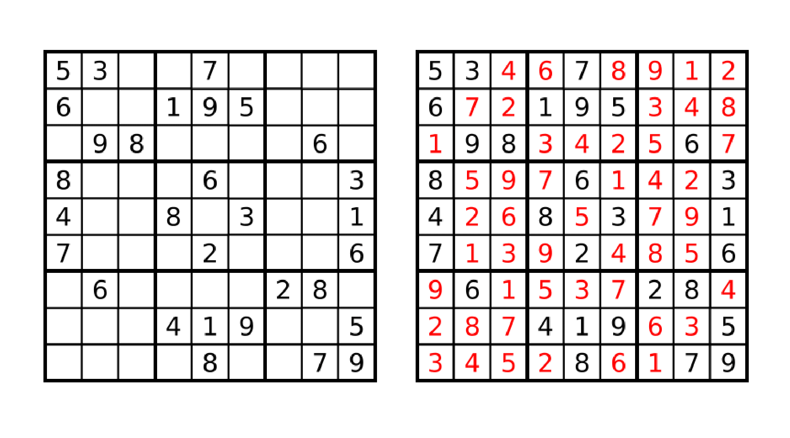

# Sudoku Project
The first assignment consist on developing a sudoku solver.

The task of this project is to solve a Generalized Sudoku puzzle using ASP. The goal of the traditional Sudoku game is to fill a 9x9 grid with digits so that each column, each row and each of the nine 3x3 sub-grids that compose the grid contains all numbers from 1 to 9.  In other words, the grid has to be filled with numbers from 1 to 9 so that the same number does not appear twice in the same row, column or in any of the nine 3x3 sub-grids of the 9x9 playing board. Initially the grid is partially filled. The Generalized Sudoku problem is similar, but instead of using a 9x9 board it uses a mxm board for some perfect scuare m (See Question 3 below for more detail).

One example of the 9x9 Sudoku is shown in the next figure. The left side shows the initial configuration, and the right side shows the same puzzle with solution numbers marked in red.



The initial state of the grid is represented by facts of predicate initial/3:

```initial(X,Y,N). % initially cell [X,Y] contains number N```

For instance, the example shown in the previous figure is represented by the following facts:

```
%%file asp/instances/ex00.lp
initial(1,1,5). initial(1,2,3). initial(1,5,7).
initial(2,1,6). initial(2,4,1). initial(2,5,9). initial(2,6,5).
initial(3,2,9). initial(3,3,8). initial(3,8,6).
initial(4,1,8). initial(4,5,6). initial(4,9,3).
initial(5,1,4). initial(5,4,8). initial(5,6,3). initial(5,9,1).
initial(6,1,7). initial(6,5,2). initial(6,9,6).
initial(7,2,6). initial(7,7,2). initial(7,8,8).
initial(8,4,4). initial(8,5,1). initial(8,6,9). initial(8,9,5).
initial(9,5,8). initial(9,8,7). initial(9,9,9).
```

The solution is represented by atoms of predicate sudoku/3:

```sudoku(X,Y,N). % the cell [X,Y] contains number N```

For instance, the solution of the previous figure consists of the following atoms:

```
sudoku(1,1,5) sudoku(1,2,3) ... sudoku(1,8,1) sudoku(1,9,2)
...
sudoku(9,1,3) sudoku(9,2,4) ... sudoku(9,8,7) sudoku(9,9,9)
```

Instructions about the problem can be found in the following link.


Framework. (Links to an external site.)
The directory asp contains the files that you need for the project. In the directory asp/instances you can find the instances, and in the directory asp/solutions you can find their solutions in json format.

You have to submit a file named sudoku.lp, included as a template in the directory asp, that contains the following line (and no more #show statements) so that in the output only the atoms of predicate sudoku/3 appear:

#show sudoku/3.

You can check if your encoding solves correctly all instances by running the Python script test.py as follows:

python asp/test.py asp/sudoku.lp 100 SAT
In this case, the timeout for each instance is set to 100 seconds, but you can use any other value instead. We have tested the script with Python version 3.6.

We recommend you to work locally in your computer, using your own installation of clingo.

For this, you can run the next cell to generate a zip file of this directory. The zip file will be stored in the parent directory with the name sudoku.zip. You can click on the folder symbol at the left of the screen to look for it and download it.

Formalities.
You can work on the solution alone or in groups of two people. Different groups have to submit different solutions, in case of plagiarism all groups involved will fail the project.

Your solution has to correctly encode all solutions for every instance. In fact, our test instances usually have several solutions. This is tested automatically by the script test.py.

We will send you further instructions about the submission process from Moodle.

 

Question 1: 4x4 Sudoku
To begin with, you will represent a 4x4 Sudoku. Later you will modify it to handle the 9x9 case.

Question 1a (25 points):
For this question, you should copy file sudoku.lp to sudoku1a.lp and modify the latter. You should fill the board with a number between 1 and 4 in each cell such that each column and each row contains all numbers between 1 and 4.

The following command can be used to find all answer sets of a particular instance stored in file instance.lp:

clingo sudoku.lp instance.lp 0

To receive credit for this question, your code must correctly solve all instances in the folder instances/4x4. Solutions to this question can be found in the folder solutions/q1a.

You can automatically test your code running

python autograder.py --question=1a

Question 1b (10 points):
For this question, you should copy sudoku1a.lp to sudoku1b.lp and modify the latter. All stable models of this new program must contain facts of the form:

subgrid(x,y,g)

for each cell (x,y) in the board where g is the subgrid each belongs.

The top left most four cells belong to the subgrid 1.
The top right most four cells belong to the subgrid 2.
The bottom left most four cells belong to the subgrid 3.
The bottom right most four cells belong to the subgrid 4.
You can automatically test your code running

python autograder.py --question=1b

Question 1c (15 points):
For this question, you should copy sudoku1b.lp to sudoku1c.lp and modify the latter. Each stable model of this program must be a solution to the 4x4 sudoku. That is, the board must be filled with a number between 1 and 4 in each cell such that each column, each row and each subgrid contains all numbers between 1 and 4.

Only the facts of the form sudoku(x,y,n) should be printed in the stable model.

To receive credit for this question, your code must correctly solve all instances in the folder instances/4x4. Solutions to this question can be found in the folder solutions/q1c.

You can automatically test your code running

python autograder.py --question=1c

Question 2: 9x9 Sudoku (40 points)
For this question, we will represent a 9x9 Sudoku. Start by copying the file to sudoku1c.lp to sudoku2.lp and modify the later to solve the 9x9 sudoku. 

To receive credit for this question, the program must correctly solve all instances in the folder instances/9x9. Solutions to this question can be found in the folder solutions/q2.

The program can be automatically tested  by running:

python autograder.py --question=2

Question 3: Generalized Sudoku (10 points)
For this question, we will represent the Generalized Sudoku. In the Generalized Sudoku the board can have any length that is a perfect square. Recall that a perfect square is a number that can be represented as the square of a natural number n. For the Generalized Sudoku, the instance will have a line specify the length of a side of the subgrid. For instance, for a 9x9 sudoku, we are going to add the line

#const n = 3

to state that the length of a side of the subgrid is 3. For the 4x4, we will add the line

#const n = 2

To receive credit for this question, the program must correctly solve all instances in the folders instances/q3/1x1, instances/q3/4x4, instances/q3/9x9 and instances/q3/16x16. Solutions for the 4x4 and 9x9 cases can be found in the folders of previous questions. Note that his instances are the same as the instances in instances/q3/4x4 and instances/q3/9x9 but adding the above lines. Solutions for the 1x1 and 16x16 cases can be found in the folders solutions/q2/1x1 and solutions/q2/16x16. Note that 1x1 case only has one possible solution.

The program can be automatically tested  by running:

python autograder.py --question=3

 

Tips: (Links to an external site.)
To begin with, it may be easier to represent a 4x4 Sudoku and once this is done, modify it to handle the 9x9 case.
Commands to find all answer sets look as follows:
clingo sudoku.lp instance.lp 0

If you are stuck you can contact us. We will do out best to answer all your questions. You can send us questions and remarks either via Moodle or by email.
Start as soon as possible to avoid running out of time. However, if you still realize that you have problems making it before the deadline, please contact us instead of copying another solution.
https://nbviewer.jupyter.org/github/potassco-asp-course/notebooks/blob/master/projects/sudoku/sudoku.ipynb (Links to an external site.)

You should submit a single file named "sudoku.lp" that contains the encoding of the class problem.
Executing in the command line "clingo sudoku.lp instance.lp 0" should print all solutions of the instance encoding in the file "instance.lp". The instance will be encoded as indicated in the link and the solution should follow the format there provided.


# ----------------------------

You can find the instructions of the project in the file [sudoku.ipynb](sudoku.ipynb).

To submit your solution, please modify the file [sudoku.lp](asp/sudoku.lp) of the directory [asp](asp) with your encoding.

Every time you push a new commit, your solution will be tested automatically.
The timeout per instance is `100` seconds, and
the actual command call for the test is:
* ``python3.6 asp/test.py -e asp/sudoku.lp -i asp/instances -s asp/solutions -t 100``

For help, type `python3.6 asp/test.py --help`.

After a few minutes you will be able to see the result of the test in the **Actions** tab.
You can get more information about the result of the test by clicking successively on:
1. The specific test.
2. "Autograding".
3. "Run education/autograding@v1".

Then scroll down until around line 150.
For each instance, you will see if the test is a:
* "success" (correct answer),
* "failure" (wrong answer),
* "timeout" (no solution found before the time runs out), or
* "error" (clingo error).
